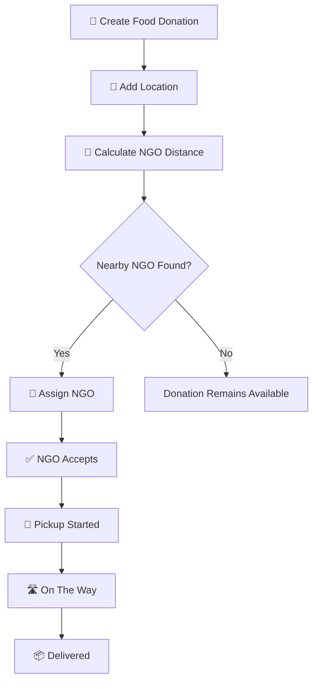
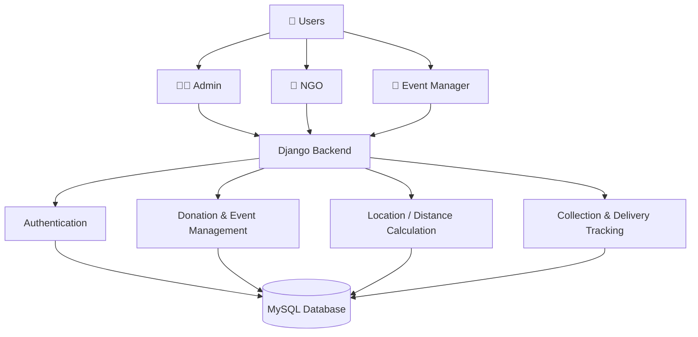

# 🍱 Food Donation System

<p align="center">
  
  
  
  
</p>

<h1 align="center">Food Donation System</h1>

<p align="center">
  <strong>Connecting Surplus Food With Those Who Need It.</strong>
</p>

<p align="center">
  A role-based Django web application designed to connect food donors
  with NGOs and simplify the food donation, acceptance, pickup, and
  delivery process.
</p>

<p align="center">
  <a href="https://github.com/bhimratna/food-donation-system">
    
  </a>
</p>

---

# 🍲 Overview

The **Food Donation System** provides a centralized platform where food donors can create donation events and NGOs can manage available food donations.

The system supports three primary roles:

```text
Admin
   │
   ├── Manage System
   │
   ├── Monitor Donations
   │
   └── View Statistics


Event Manager / Donor
   │
   └── Create Food Donation
              │
              ▼
        Location Analysis
              │
              ▼
          Nearby NGO
              │
              ▼
            NGO
              │
              ▼
       Accept → Pickup → Delivery
```

---

# 🎯 Problem Statement

Large quantities of usable food can be wasted after events, functions, restaurants, and other activities while NGOs may simultaneously require food for people in need.

Manual coordination between donors and NGOs can make the donation process difficult to organize and track.

The project addresses this problem by providing a centralized digital workflow for:

- Food donation registration
- NGO assignment
- Donation acceptance
- Pickup tracking
- Delivery tracking

---

# 💡 Proposed Solution

The Food Donation System creates a structured connection between **food donors and NGOs**.

```text
Food Donor
    ↓
Create Donation
    ↓
Food + Quantity + Location
    ↓
Find Nearby NGO
    ↓
Assign Donation
    ↓
NGO Accepts
    ↓
Pickup Started
    ↓
On The Way
    ↓
Delivered
```

---

# ✨ Key Features

### 🔐 Role-Based Authentication

The system supports:

- 👨‍💼 Admin
- 🏢 NGO
- 🍱 Event Manager / Donor

Each role is redirected to its respective dashboard.

---

### 🍱 Food Donation Management

Event Managers can create donation events containing:

- Event name
- Food items
- Quantity
- Location
- Expiry time
- Food image
- Latitude & longitude

---

### 📍 Nearest NGO Assignment

When location information is available, the system calculates the geographical distance between the donation event and registered NGOs.

The nearest available NGO can then be assigned to the donation.

```text
Donation Location
       ↓
   Distance Check
       ↓
Nearest NGO
       ↓
   Assignment
```

---

### 🚚 Donation Tracking

Each donation follows a structured status workflow:

```text
Accepted
   ↓
Pickup Started
   ↓
On The Way
   ↓
Delivered
```

This allows the donation to be tracked from acceptance to final delivery.

---

### 📊 Dashboard System

Different dashboards provide role-specific information.

| Role | Dashboard |
|---|---|
| Admin | System statistics |
| NGO | Assigned donations |
| Event Manager | Donation management |

---

### ⚡ Donation Priority

Donations can be prioritized using factors such as:

- Food expiry time
- Food quantity

This helps identify donations that may require faster action.

---

### 🖼️ Food Image Upload

Donors can upload images of donated food while creating an event.

---

# 🧠 How It Works



---

# 🏗️ System Architecture



---

# 🛠️ Technology Stack

| Technology | Purpose |
|---|---|
| 🐍 Python | Backend Programming |
| 🎯 Django 4.2 | Web Framework |
| 🗄️ MySQL | Database |
| 🌐 HTML5 | Frontend Structure |
| 🎨 CSS3 | Styling |
| 🅱️ Bootstrap | Responsive UI |
| ⚡ JavaScript | Client-Side Functionality |
| 📍 Geopy | Geographic Distance Calculation |
| 🔐 Django Auth | Authentication |
| 🔧 Git | Version Control |
| 🐙 GitHub | Source Code Hosting |

---

# 📂 Project Structure

```text
food-donation-system/
│
└── food_donation/
    │
    ├── core/
    │   ├── migrations/
    │   ├── templates/
    │   ├── admin.py
    │   ├── models.py
    │   ├── urls.py
    │   └── views.py
    │
    ├── food_donation/
    │   ├── settings.py
    │   ├── urls.py
    │   ├── wsgi.py
    │   └── asgi.py
    │
    ├── static/
    ├── food_images/
    ├── manage.py
    ├── requirements.txt
    └── .gitignore
```

---

# 🚀 Getting Started

## Prerequisites

Make sure you have:

- Python 3.10+
- MySQL
- Git

---

## 1. Clone Repository

```bash
git clone https://github.com/bhimratna/food-donation-system.git
```

## 2. Enter Project

```bash
cd food-donation-system/food_donation
```

## 3. Create Virtual Environment

```bash
python -m venv venv
```

### Windows

```bash
venv\Scripts\activate
```

## 4. Install Dependencies

```bash
pip install -r requirements.txt
```

## 5. Configure Database

Create the MySQL database:

```sql
CREATE DATABASE food_donation_db;
```

Configure the database credentials in:

```text
food_donation/settings.py
```

## 6. Run Migrations

```bash
python manage.py makemigrations
python manage.py migrate
```

## 7. Create Admin

```bash
python manage.py createsuperuser
```

## 8. Start Server

```bash
python manage.py runserver
```

Open:

```text
http://127.0.0.1:8000/
```

---

# 📸 Screenshots

Add your actual application screenshots here.

Recommended:

```text
Login
Admin Dashboard
NGO Dashboard
Create Donation
Donation List
Donation Tracking
```

Example:

```markdown


```

---

# 🔮 Future Roadmap

- [ ] 📱 Mobile Application
- [ ] 🔔 Email & Push Notifications
- [ ] 🗺️ Advanced Map Integration
- [ ] 🚚 Real-Time Pickup Tracking
- [ ] 📊 Advanced Analytics
- [ ] 🤖 AI-Powered Donation Recommendations
- [ ] ☁️ Cloud Deployment
- [ ] 📈 Donation Impact Reports

---

# 👨‍💻 Author

<p align="center">
  
</p>

<h2 align="center">Bhimratna Sardar</h2>

<p align="center">
  B.Tech Computer Engineering
</p>

<p align="center">
  Interested in Python, Django, Artificial Intelligence,
  Backend Development and Full-Stack Applications.
</p>

<p align="center">
  <a href="https://github.com/bhimratna">
    
  </a>
</p>

---

# ⭐ Support

If you find this project useful or interesting:

⭐ Star the repository  
🐛 Report issues  
💡 Suggest improvements  
🤝 Contribute to the project

---

<p align="center">

### 🍱 Food Donation System

<strong>Reduce Food Waste. Connect Communities. Make Every Meal Matter.</strong>

<br><br>

Built with ❤️ using Python & Django.

</p>
